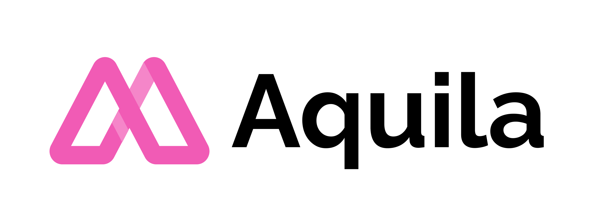

  

---

  
An open-source full stack webapp, built for academic purposes.

  
  
  
  
  

## About

Aquila is an academic project which packs a lot of features together and built for National Higher Secondary School, Kerala. This is an open-source project and developed by Team Syncrolaze.

<!-- Few more words about the project -->

## Built with

  <!-- List of technologies used in the project -->

  
  
  
  
  
  
  
  

 

We use [GitLab](https://gitlab.com/syncrolaze/aquila) as our primary source control system and If your looking this project from [Github](https://github.com/syncrolaze/aquila) then probably it's a mirror of the GitLab instance.

## Features

- [x] **Material UI:** Minimal, clean and responsive design.

- [x] **SEO:** Rich User experiences in a uniform way, without compromising Search Engine Optimisation (SEO) factors that are key to good ranking on Google and other search engines.

- [x] **Gallery Page:** A gallery of images, videos and documents.

- [x] **Custom 404:** A custom 404 page for the website.

- [x] **Clean Code:** The code is clean and well documented.

If you have any feature requests or suggestions, please feel free to open an issue on [GitLab](https://gitlab.com/syncrolaze/aquila).

## Contributing

To see how to Contribute, visit [DEVELOPERS.md](DEVELOPERS.md).

## License

This project is currently licensed under the **[MIT](LICENSE)**  

Copyright 2022 Syncrolaze.